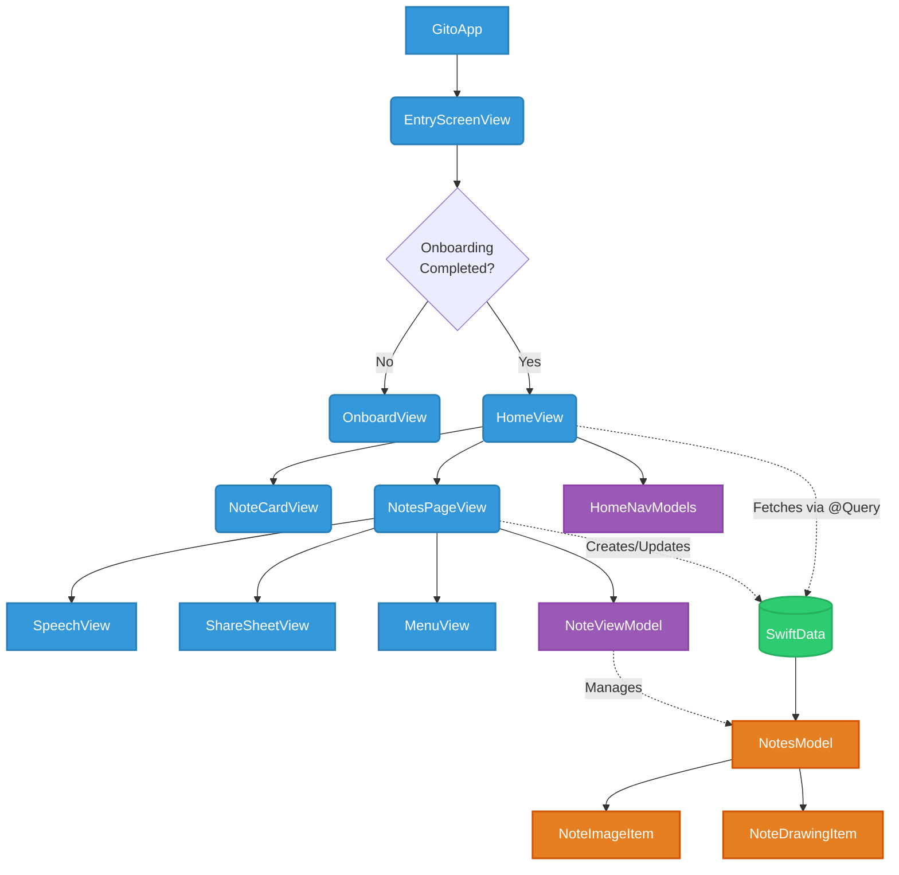

# Gito 📝

A powerful, aesthetically pleasing note-taking iOS application built with SwiftUI and SwiftData.

## ✨ Features

- **Rich Notes:** Keep track of your ideas, thoughts, and tasks with an intuitive interface.
- **Customization:** Personalize your notes! Choose from a variety of beautiful page colors (e.g., Coral, Lemon Yellow, Sage, Evergreen Moss) and custom background images.
- **Media Support:** Enhance your notes by attaching photos and hand-drawn sketches.
- **Speech-to-Text:** Dictate your notes effortlessly using the built-in speech recognition view.
- **Offline First:** Data is persisted locally using SwiftData, ensuring a fast and seamless experience without the need for an internet connection.
- **Smooth Animations:** Crafted with care to provide a fluid user experience with native SwiftUI animations.

## 🏗 Architecture & Data Flow

Gito follows a modern SwiftUI architecture, utilizing `SwiftData` for robust, native local persistence. Below is a high-level overview of the application flow and data models.

## 🛠 Requirements

- **iOS:** 17.0+
- **Xcode:** 15.0+
- **Swift:** 5.9+

## 💻 Tech Stack

- **UI Framework:** SwiftUI
- **Database:** SwiftData
- **Architecture:** SwiftUI native State Management with ViewModels where appropriate.

## 🚀 Getting Started

1. Clone the repository.
2. Open `Gito.xcodeproj` in Xcode.
3. Wait for Swift Package Manager to resolve any dependencies (if applicable).
4. Select your preferred iOS simulator or device (iOS 17+).
5. Build and run the project (`Cmd + R`).

## 🎨 Screenshots
*(Add your beautiful app screenshots here!)*

---
*Built with ❤️ using SwiftUI*
